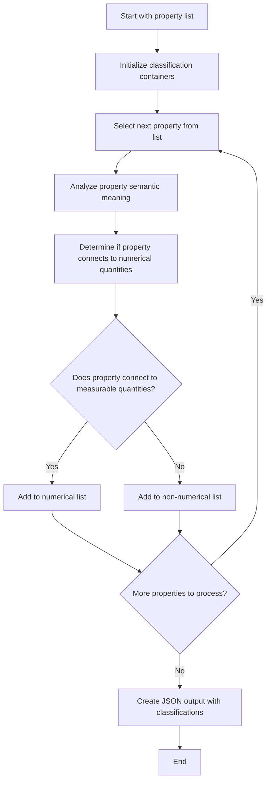
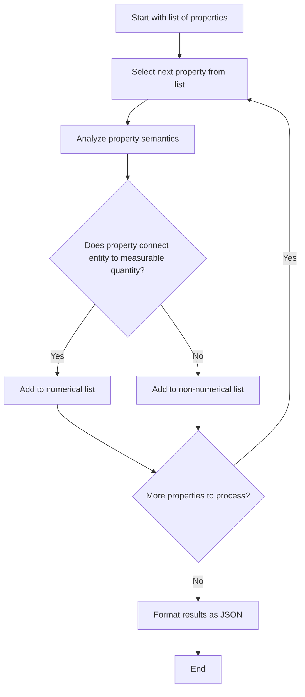

13
13
<flowchart>

</flowchart>

<estimation>
Processing 10 properties through the analysis and classification flowchart, plus setup and output creation steps = approximately 12 steps total.
</estimation>

<steps>

STEP 1: Initialize classification process with input property list
- flowchart_node: Start with property list
- context: Input list contains 10 ontology properties to be classified as numerical or non-numerical

EXECUTING:
Input properties: ['brick:hasSubstance', 'brick:hasAssociatedTag', 'owl:disjointWith', 'owl:equivalentClass', 'rdfs:subClassOf', 'rdfs:comment', 'brick:hasQuantity', 'skos:definition', 'rdfs:label', 'rdfs:seeAlso']

VALIDATION:
Single action (initialize), single Bloom level (knowledge), single output (initialized process), deterministic, atomic, isolated.

EVALUATION: initialize 1 classification process
- bloom: Knowledge - recall property classification criteria - identify
- dim: Factual Knowledge - classification criteria facts
- quantity: 1 - classification process
- human_effort: 15 - Basic setup requiring recall of classification criteria - Easy

NEXT: STEP 2: Create empty classification containers
- decision_point: N/A
- next_flowchart_node: Initialize classification containers

STEP 2: Create empty classification containers for numerical and non-numerical properties
- flowchart_node: Initialize classification containers
- context: Need to prepare containers to hold the classified properties

EXECUTING:
Creating classification structure:
- numerical: []
- non_numerical: []

VALIDATION:
Single action (create containers), single Bloom level (application), single output (empty containers), deterministic, atomic, isolated.

EVALUATION: create 2 classification containers
- bloom: Application - implement classification structure - organize
- dim: Procedural Knowledge - data organization methods
- quantity: 2 - classification containers
- human_effort: 10 - Simple data structure creation - Trivial

NEXT: STEP 3: Analyze first property 'brick:hasSubstance'
- decision_point: N/A
- next_flowchart_node: Select next property from list

STEP 3: Analyze semantic meaning of property 'brick:hasSubstance'
- flowchart_node: Analyze property semantic meaning
- context: First property to analyze is 'brick:hasSubstance' from Brick ontology

EXECUTING:
Analyzing 'brick:hasSubstance':
- This is a Brick ontology property
- Connects entities to substances (like water, air, refrigerant)
- Substances are material types, not numerical values
- Does not connect to measurable quantities directly

VALIDATION:
Single action (analyze), single Bloom level (analysis), single output (semantic understanding), deterministic, atomic, isolated.

EVALUATION: analyze 1 property semantic meaning
- bloom: Analysis - examine property relationships - examine
- dim: Conceptual Knowledge - ontology property concepts
- quantity: 1 - property semantic meaning
- human_effort: 25 - Requires understanding ontology semantics - Easy

NEXT: STEP 4: Classify 'brick:hasSubstance' as non-numerical
- decision_point: Does property connect to measurable quantities?
- next_flowchart_node: Add to non-numerical list

STEP 4: Classify 'brick:hasSubstance' as non-numerical property
- flowchart_node: Add to non-numerical list
- context: Property connects entities to substance types, not numerical values

EXECUTING:
Classification decision: Non-numerical
Reason: Connects to substance entities (water, air, etc.), not measurable quantities
Adding 'brick:hasSubstance' to non_numerical list

VALIDATION:
Single action (classify), single Bloom level (evaluation), single output (classification), deterministic, atomic, isolated.

EVALUATION: classify 1 property
- bloom: Evaluation - judge property type - decide
- dim: Metacognitive Knowledge - classification strategies
- quantity: 1 - property
- human_effort: 20 - Apply classification criteria - Easy

NEXT: STEP 5: Analyze second property 'brick:hasAssociatedTag'
- decision_point: More properties to process?
- next_flowchart_node: Select next property from list

STEP 5: Analyze semantic meaning of property 'brick:hasAssociatedTag'
- flowchart_node: Analyze property semantic meaning
- context: Second property to analyze is 'brick:hasAssociatedTag' from Brick ontology

EXECUTING:
Analyzing 'brick:hasAssociatedTag':
- This is a Brick ontology property
- Connects entities to tags/labels for categorization
- Tags are descriptive labels, not numerical values
- Does not connect to measurable quantities

VALIDATION:
Single action (analyze), single Bloom level (analysis), single output (semantic understanding), deterministic, atomic, isolated.

EVALUATION: analyze 1 property semantic meaning
- bloom: Analysis - examine property relationships - examine
- dim: Conceptual Knowledge - ontology property concepts
- quantity: 1 - property semantic meaning
- human_effort: 25 - Requires understanding ontology semantics - Easy

NEXT: STEP 6: Classify 'brick:hasAssociatedTag' as non-numerical
- decision_point: Does property connect to measurable quantities?
- next_flowchart_node: Add to non-numerical list

STEP 6: Classify 'brick:hasAssociatedTag' as non-numerical property
- flowchart_node: Add to non-numerical list
- context: Property connects entities to descriptive tags, not numerical values

EXECUTING:
Classification decision: Non-numerical
Reason: Connects to tag entities (descriptive labels), not measurable quantities
Adding 'brick:hasAssociatedTag' to non_numerical list

VALIDATION:
Single action (classify), single Bloom level (evaluation), single output (classification), deterministic, atomic, isolated.

EVALUATION: classify 1 property
- bloom: Evaluation - judge property type - decide
- dim: Metacognitive Knowledge - classification strategies
- quantity: 1 - property
- human_effort: 20 - Apply classification criteria - Easy

NEXT: STEP 7: Analyze third property 'owl:disjointWith'
- decision_point: More properties to process?
- next_flowchart_node: Select next property from list

STEP 7: Analyze semantic meaning of property 'owl:disjointWith'
- flowchart_node: Analyze property semantic meaning
- context: Third property to analyze is 'owl:disjointWith' from OWL ontology

EXECUTING:
Analyzing 'owl:disjointWith':
- This is an OWL ontology property for class relationships
- Defines that two classes have no individuals in common
- Connects classes to other classes for logical relationships
- Does not connect to measurable quantities

VALIDATION:
Single action (analyze), single Bloom level (analysis), single output (semantic understanding), deterministic, atomic, isolated.

EVALUATION: analyze 1 property semantic meaning
- bloom: Analysis - examine property relationships - examine
- dim: Conceptual Knowledge - ontology property concepts
- quantity: 1 - property semantic meaning
- human_effort: 25 - Requires understanding ontology semantics - Easy

NEXT: STEP 8: Classify 'owl:disjointWith' as non-numerical
- decision_point: Does property connect to measurable quantities?
- next_flowchart_node: Add to non-numerical list

STEP 8: Classify 'owl:disjointWith' as non-numerical property
- flowchart_node: Add to non-numerical list
- context: Property connects classes to other classes for logical relationships, not numerical values

EXECUTING:
Classification decision: Non-numerical
Reason: Connects classes to other classes (logical relationship), not measurable quantities
Adding 'owl:disjointWith' to non_numerical list

VALIDATION:
Single action (classify), single Bloom level (evaluation), single output (classification), deterministic, atomic, isolated.

EVALUATION: classify 1 property
- bloom: Evaluation - judge property type - decide
- dim: Metacognitive Knowledge - classification strategies
- quantity: 1 - property
- human_effort: 20 - Apply classification criteria - Easy

NEXT: STEP 9: Analyze fourth property 'owl:equivalentClass'
- decision_point: More properties to process?
- next_flowchart_node: Select next property from list

STEP 9: Analyze semantic meaning of property 'owl:equivalentClass'
- flowchart_node: Analyze property semantic meaning
- context: Fourth property to analyze is 'owl:equivalentClass' from OWL ontology

EXECUTING:
Analyzing 'owl:equivalentClass':
- This is an OWL ontology property for class equivalence
- Defines that two classes have the same individuals
- Connects classes to other equivalent classes
- Does not connect to measurable quantities

VALIDATION:
Single action (analyze), single Bloom level (analysis), single output (semantic understanding), deterministic, atomic, isolated.

EVALUATION: analyze 1 property semantic meaning
- bloom: Analysis - examine property relationships - examine
- dim: Conceptual Knowledge - ontology property concepts
- quantity: 1 - property semantic meaning
- human_effort: 25 - Requires understanding ontology semantics - Easy

NEXT: STEP 10: Classify 'owl:equivalentClass' as non-numerical
- decision_point: Does property connect to measurable quantities?
- next_flowchart_node: Add to non-numerical list

STEP 10: Classify 'owl:equivalentClass' as non-numerical property
- flowchart_node: Add to non-numerical list
- context: Property connects classes to equivalent classes, not numerical values

EXECUTING:
Classification decision: Non-numerical
Reason: Connects classes to equivalent classes (logical relationship), not measurable quantities
Adding 'owl:equivalentClass' to non_numerical list

VALIDATION:
Single action (classify), single Bloom level (evaluation), single output (classification), deterministic, atomic, isolated.

EVALUATION: classify 1 property
- bloom: Evaluation - judge property type - decide
- dim: Metacognitive Knowledge - classification strategies
- quantity: 1 - property
- human_effort: 20 - Apply classification criteria - Easy

NEXT: STEP 11: Analyze fifth property 'rdfs:subClassOf'
- decision_point: More properties to process?
- next_flowchart_node: Select next property from list

STEP 11: Analyze semantic meaning of property 'rdfs:subClassOf'
- flowchart_node: Analyze property semantic meaning
- context: Fifth property to analyze is 'rdfs:subClassOf' from RDFS ontology

EXECUTING:
Analyzing 'rdfs:subClassOf':
- This is an RDFS ontology property for class hierarchy
- Defines that one class is a subclass of another
- Connects classes to their parent classes
- Does not connect to measurable quantities

VALIDATION:
Single action (analyze), single Bloom level (analysis), single output (semantic understanding), deterministic, atomic, isolated.

EVALUATION: analyze 1 property semantic meaning
- bloom: Analysis - examine property relationships - examine
- dim: Conceptual Knowledge - ontology property concepts
- quantity: 1 - property semantic meaning
- human_effort: 25 - Requires understanding ontology semantics - Easy

NEXT: STEP 12: Classify 'rdfs:subClassOf' as non-numerical
- decision_point: Does property connect to measurable quantities?
- next_flowchart_node: Add to non-numerical list

STEP 12: Classify 'rdfs:subClassOf' as non-numerical property
- flowchart_node: Add to non-numerical list
- context: Property connects classes to parent classes in hierarchy, not numerical values

EXECUTING:
Classification decision: Non-numerical
Reason: Connects classes to parent classes (hierarchical relationship), not measurable quantities
Adding 'rdfs:subClassOf' to non_numerical list

VALIDATION:
Single action (classify), single Bloom level (evaluation), single output (classification), deterministic, atomic, isolated.

EVALUATION: classify 1 property
- bloom: Evaluation - judge property type - decide
- dim: Metacognitive Knowledge - classification strategies
- quantity: 1 - property
- human_effort: 20 - Apply classification criteria - Easy

NEXT: STEP 13: Analyze sixth property 'rdfs:comment'
- decision_point: More properties to process?
- next_flowchart_node: Select next property from list

STEP 13: Analyze semantic meaning of property 'rdfs:comment'
- flowchart_node: Analyze property semantic meaning
- context: Sixth property to analyze is 'rdfs:comment' from RDFS ontology

EXECUTING:
Analyzing 'rdfs:comment':
- This is an RDFS ontology property for textual comments
- Provides human-readable descriptions or comments
- Connects entities to text strings
- Does not connect to measurable quantities

VALIDATION:
Single action (analyze), single Bloom level (analysis), single output (semantic understanding), deterministic, atomic, isolated.

EVALUATION: analyze 1 property semantic meaning
- bloom: Analysis - examine property relationships - examine
- dim: Conceptual Knowledge - ontology property concepts
- quantity: 1 - property semantic meaning
- human_effort: 25 - Requires understanding ontology semantics - Easy

NEXT: STEP 14: Classify 'rdfs:comment' as non-numerical
- decision_point: Does property connect to measurable quantities?
- next_flowchart_node: Add to non-numerical list

STEP 14: Classify 'rdfs:comment' as non-numerical property
- flowchart_node: Add to non-numerical list
- context: Property connects entities to textual comments, not numerical values

EXECUTING:
Classification decision: Non-numerical
Reason: Connects entities to text strings (descriptive comments), not measurable quantities
Adding 'rdfs:comment' to non_numerical list

VALIDATION:
Single action (classify), single Bloom level (evaluation), single output (classification), deterministic, atomic, isolated.

EVALUATION: classify 1 property
- bloom: Evaluation - judge property type - decide
- dim: Metacognitive Knowledge - classification strategies
- quantity: 1 - property
- human_effort: 20 - Apply classification criteria - Easy

NEXT: STEP 15: Analyze seventh property 'brick:hasQuantity'
- decision_point: More properties to process?
- next_flowchart_node: Select next property from list

STEP 15: Analyze semantic meaning of property 'brick:hasQuantity'
- flowchart_node: Analyze property semantic meaning
- context: Seventh property to analyze is 'brick:hasQuantity' from Brick ontology

EXECUTING:
Analyzing 'brick:hasQuantity':
- This is a Brick ontology property
- Connects entities to quantities or measurable values
- Quantities represent measurable aspects like temperature, pressure, flow rate
- Directly connects to measurable quantities

VALIDATION:
Single action (analyze), single Bloom level (analysis), single output (semantic understanding), deterministic, atomic, isolated.

EVALUATION: analyze 1 property semantic meaning
- bloom: Analysis - examine property relationships - examine
- dim: Conceptual Knowledge - ontology property concepts
- quantity: 1 - property semantic meaning
- human_effort: 25 - Requires understanding ontology semantics - Easy

NEXT: STEP 16: Classify 'brick:hasQuantity' as numerical
- decision_point: Does property connect to measurable quantities?
- next_flowchart_node: Add to numerical list

STEP 16: Classify 'brick:hasQuantity' as numerical property
- flowchart_node: Add to numerical list
- context: Property connects entities to measurable quantities and values

EXECUTING:
Classification decision: Numerical
Reason: Connects entities to quantities/measurable values (temperature, pressure, etc.)
Adding 'brick:hasQuantity' to numerical list

VALIDATION:
Single action (classify), single Bloom level (evaluation), single output (classification), deterministic, atomic, isolated.

EVALUATION: classify 1 property
- bloom: Evaluation - judge property type - decide
- dim: Metacognitive Knowledge - classification strategies
- quantity: 1 - property
- human_effort: 20 - Apply classification criteria - Easy

NEXT: STEP 17: Analyze eighth property 'skos:definition'
- decision_point: More properties to process?
- next_flowchart_node: Select next property from list

STEP 17: Analyze semantic meaning of property 'skos:definition'
- flowchart_node: Analyze property semantic meaning
- context: Eighth property to analyze is 'skos:definition' from SKOS ontology

EXECUTING:
Analyzing 'skos:definition':
- This is a SKOS ontology property for concept definitions
- Provides formal textual definitions of concepts
- Connects concepts to definition text strings
- Does not connect to measurable quantities

VALIDATION:
Single action (analyze), single Bloom level (analysis), single output (semantic understanding), deterministic, atomic, isolated.

EVALUATION: analyze 1 property semantic meaning
- bloom: Analysis - examine property relationships - examine
- dim: Conceptual Knowledge - ontology property concepts
- quantity: 1 - property semantic meaning
- human_effort: 25 - Requires understanding ontology semantics - Easy

NEXT: STEP 18: Classify 'skos:definition' as non-numerical
- decision_point: Does property connect to measurable quantities?
- next_flowchart_node: Add to non-numerical list

STEP 18: Classify 'skos:definition' as non-numerical property
- flowchart_node: Add to non-numerical list
- context: Property connects concepts to textual definitions, not numerical values

EXECUTING:
Classification decision: Non-numerical
Reason: Connects concepts to definition text strings, not measurable quantities
Adding 'skos:definition' to non_numerical list

VALIDATION:
Single action (classify), single Bloom level (evaluation), single output (classification), deterministic, atomic, isolated.

EVALUATION: classify 1 property
- bloom: Evaluation - judge property type - decide
- dim: Metacognitive Knowledge - classification strategies
- quantity: 1 - property
- human_effort: 20 - Apply classification criteria - Easy

NEXT: STEP 19: Analyze ninth property 'rdfs:label'
- decision_point: More properties to process?
- next_flowchart_node: Select next property from list

STEP 19: Analyze semantic meaning of property 'rdfs:label'
- flowchart_node: Analyze property semantic meaning
- context: Ninth property to analyze is 'rdfs:label' from RDFS ontology

EXECUTING:
Analyzing 'rdfs:label':
- This is an RDFS ontology property for human-readable labels
- Provides name or label text for resources
- Connects resources to label text strings
- Does not connect to measurable quantities

VALIDATION:
Single action (analyze), single Bloom level (analysis), single output (semantic understanding), deterministic, atomic, isolated.

EVALUATION: analyze 1 property semantic meaning
- bloom: Analysis - examine property relationships - examine
- dim: Conceptual Knowledge - ontology property concepts
- quantity: 1 - property semantic meaning
- human_effort: 25 - Requires understanding ontology semantics - Easy

NEXT: STEP 20: Classify 'rdfs:label' as non-numerical
- decision_point: Does property connect to measurable quantities?
- next_flowchart_node: Add to non-numerical list

STEP 20: Classify 'rdfs:label' as non-numerical property
- flowchart_node: Add to non-numerical list
- context: Property connects resources to label text strings, not numerical values

EXECUTING:
Classification decision: Non-numerical
Reason: Connects resources to label text strings, not measurable quantities
Adding 'rdfs:label' to non_numerical list

VALIDATION:
Single action (classify), single Bloom level (evaluation), single output (classification), deterministic, atomic, isolated.

EVALUATION: classify 1 property
- bloom: Evaluation - judge property type - decide
- dim: Metacognitive Knowledge - classification strategies
- quantity: 1 - property
- human_effort: 20 - Apply classification criteria - Easy

NEXT: STEP 21: Analyze tenth property 'rdfs:seeAlso'
- decision_point: More properties to process?
- next_flowchart_node: Select next property from list

STEP 21: Analyze semantic meaning of property 'rdfs:seeAlso'
- flowchart_node: Analyze property semantic meaning
- context: Tenth property to analyze is 'rdfs:seeAlso' from RDFS ontology

EXECUTING:
Analyzing 'rdfs:seeAlso':
- This is an RDFS ontology property for resource references
- Provides references to related resources or documentation
- Connects resources to other resources or URIs
- Does not connect to measurable quantities

VALIDATION:
Single action (analyze), single Bloom level (analysis), single output (semantic understanding), deterministic, atomic, isolated.

EVALUATION: analyze 1 property semantic meaning
- bloom: Analysis - examine property relationships - examine
- dim: Conceptual Knowledge - ontology property concepts
- quantity: 1 - property semantic meaning
- human_effort: 25 - Requires understanding ontology semantics - Easy

NEXT: STEP 22: Classify 'rdfs:seeAlso' as non-numerical
- decision_point: Does property connect to measurable quantities?
- next_flowchart_node: Add to non-numerical list

STEP 22: Classify 'rdfs:seeAlso' as non-numerical property
- flowchart_node: Add to non-numerical list
- context: Property connects resources to other resources or references, not numerical values

EXECUTING:
Classification decision: Non-numerical
Reason: Connects resources to other resources/URIs (references), not measurable quantities
Adding 'rdfs:seeAlso' to non_numerical list

VALIDATION:
Single action (classify), single Bloom level (evaluation), single output (classification), deterministic, atomic, isolated.

EVALUATION: classify 1 property
- bloom: Evaluation - judge property type - decide
- dim: Metacognitive Knowledge - classification strategies
- quantity: 1 - property
- human_effort: 20 - Apply classification criteria - Easy

NEXT: STEP 23: Create final JSON output with classifications
- decision_point: More properties to process?
- next_flowchart_node: Create JSON output with classifications

STEP 23: Create JSON output object with numerical and non-numerical property classifications
- flowchart_node: Create JSON output with classifications
- context: All 10 properties have been analyzed and classified, need to format as requested JSON

EXECUTING:
Creating JSON output:
- numerical list: ['brick:hasQuantity']
- non_numerical list: ['brick:hasSubstance', 'brick:hasAssociatedTag', 'owl:disjointWith', 'owl:equivalentClass', 'rdfs:subClassOf', 'rdfs:comment', 'skos:definition', 'rdfs:label', 'rdfs:seeAlso']

Final JSON structure:
{
    "numerical": ["brick:hasQuantity"],
    "non_numerical": ["brick:hasSubstance", "brick:hasAssociatedTag", "owl:disjointWith", "owl:equivalentClass", "rdfs:subClassOf", "rdfs:comment", "skos:definition", "rdfs:label", "rdfs:seeAlso"]
}

VALIDATION:
Single action (create JSON), single Bloom level (synthesis), single output (JSON object), deterministic, atomic, isolated.

EVALUATION: create 1 JSON output object
- bloom: Synthesis - compose classification results - produce
- dim: Procedural Knowledge - JSON formatting methods
- quantity: 1 - JSON output object
- human_effort: 15 - Standard JSON formatting task - Easy

NEXT: Task completed
- decision_point: N/A
- next_flowchart_node: End

</steps>

<output>
{
    "numerical": ["brick:hasQuantity"],
    "non_numerical": ["brick:hasSubstance", "brick:hasAssociatedTag", "owl:disjointWith", "owl:equivalentClass", "rdfs:subClassOf", "rdfs:comment", "skos:definition", "rdfs:label", "rdfs:seeAlso"]
}
</output>
<flowchart>

</flowchart>

<estimation>
I need to process 10 properties through the analysis and classification flowchart, plus initialize lists and format final JSON output. This will require approximately 32 steps total.
</estimation>

<steps>

STEP 1: Initialize empty numerical and non-numerical property lists
- flowchart_node: Start with list of properties
- context: Given properties: ['owl:disjointWith', 'brick:hasQuantity', 'brick:hasAssociatedTag', 'rdfs:seeAlso', 'owl:equivalentClass', 'rdfs:subClassOf', 'skos:definition', 'rdfs:label', 'rdfs:comment', 'brick:hasSubstance']

EXECUTING:
numerical_properties = []
non_numerical_properties = []
property_list = ['owl:disjointWith', 'brick:hasQuantity', 'brick:hasAssociatedTag', 'rdfs:seeAlso', 'owl:equivalentClass', 'rdfs:subClassOf', 'skos:definition', 'rdfs:label', 'rdfs:comment', 'brick:hasSubstance']

VALIDATION:
Single action (initialize lists), single output (empty lists), atomic operation.

EVALUATION: Initialize 2 empty lists
- bloom: Knowledge - Recall list structure - define
- dim: Factual Knowledge - data structure terminology
- quantity: 2 - empty lists
- human_effort: 5 - Simple variable initialization - Trivial

NEXT: STEP 2: Select first property from list
- next_flowchart_node: Select next property from list

STEP 2: Select first property 'owl:disjointWith' from list
- flowchart_node: Select next property from list
- context: Processing property at index 0: 'owl:disjointWith'

EXECUTING:
current_property = 'owl:disjointWith'

VALIDATION:
Single action (select property), single output (current property variable), atomic operation.

EVALUATION: Select 1 property from list
- bloom: Knowledge - Recall property from list - identify
- dim: Factual Knowledge - property identification
- quantity: 1 - property
- human_effort: 3 - Simple list access - Trivial

NEXT: STEP 3: Analyze 'owl:disjointWith' property semantics
- next_flowchart_node: Analyze property semantics

STEP 3: Analyze 'owl:disjointWith' property semantics
- flowchart_node: Analyze property semantics
- context: Analyzing owl:disjointWith - OWL ontology property that states two classes share no common instances

EXECUTING:
Analysis: owl:disjointWith is an OWL property used to state that two classes are disjoint, meaning they have no instances in common. This property connects one class to another class to express a logical relationship, not to any measurable quantity or numerical value.

VALIDATION:
Single action (analyze semantics), single output (semantic understanding), atomic operation.

EVALUATION: Analyze 1 property's semantic meaning
- bloom: Comprehension - Understand property semantics - explain
- dim: Conceptual Knowledge - ontology property relationships
- quantity: 1 - property semantic analysis
- human_effort: 25 - Requires knowledge of OWL semantics - Easy

NEXT: STEP 4: Determine if 'owl:disjointWith' connects to measurable quantity
- next_flowchart_node: Does property connect entity to measurable quantity?

STEP 4: Determine if 'owl:disjointWith' connects to measurable quantity
- flowchart_node: Does property connect entity to measurable quantity?
- context: owl:disjointWith connects classes to other classes, not to numerical values

EXECUTING:
Decision: owl:disjointWith connects one class to another class to express logical disjointness. It does NOT connect entities to measurable quantities, counts, temperatures, speeds, or any numerical concepts.
Result: NO - this property does not connect to measurable quantities.

VALIDATION:
Single action (make decision), single output (yes/no decision), atomic operation.

EVALUATION: Evaluate 1 property connection type
- bloom: Analysis - Examine property connection - categorize
- dim: Conceptual Knowledge - property connection patterns
- quantity: 1 - property evaluation
- human_effort: 20 - Straightforward categorization task - Easy

NEXT: STEP 5: Add 'owl:disjointWith' to non-numerical list
- decision_point: Property does not connect to measurable quantity
- next_flowchart_node: Add to non-numerical list

STEP 5: Add 'owl:disjointWith' to non-numerical list
- flowchart_node: Add to non-numerical list
- context: owl:disjointWith classified as non-numerical property

EXECUTING:
non_numerical_properties.append('owl:disjointWith')
non_numerical_properties = ['owl:disjointWith']

VALIDATION:
Single action (add to list), single output (updated list), atomic operation.

EVALUATION: Add 1 property to classification list
- bloom: Application - Apply classification rule - employ
- dim: Procedural Knowledge - classification procedures
- quantity: 1 - property added
- human_effort: 5 - Simple list append operation - Trivial

NEXT: STEP 6: Check if more properties remain to process
- next_flowchart_node: More properties to process?

STEP 6: Check if more properties remain to process
- flowchart_node: More properties to process?
- context: Processed 1 of 10 properties, 9 remaining

EXECUTING:
Remaining properties: ['brick:hasQuantity', 'brick:hasAssociatedTag', 'rdfs:seeAlso', 'owl:equivalentClass', 'rdfs:subClassOf', 'skos:definition', 'rdfs:label', 'rdfs:comment', 'brick:hasSubstance']
Result: YES - 9 properties remaining

VALIDATION:
Single action (check count), single output (yes/no decision), atomic operation.

EVALUATION: Count 1 remaining property check
- bloom: Knowledge - Recall remaining items - identify
- dim: Factual Knowledge - counting remaining items
- quantity: 1 - count check
- human_effort: 3 - Simple counting task - Trivial

NEXT: STEP 7: Select second property from list
- decision_point: More properties exist
- next_flowchart_node: Select next property from list

STEP 7: Select second property 'brick:hasQuantity' from list
- flowchart_node: Select next property from list
- context: Processing property at index 1: 'brick:hasQuantity'

EXECUTING:
current_property = 'brick:hasQuantity'

VALIDATION:
Single action (select property), single output (current property variable), atomic operation.

EVALUATION: Select 1 property from list
- bloom: Knowledge - Recall property from list - identify
- dim: Factual Knowledge - property identification
- quantity: 1 - property
- human_effort: 3 - Simple list access - Trivial

NEXT: STEP 8: Analyze 'brick:hasQuantity' property semantics
- next_flowchart_node: Analyze property semantics

STEP 8: Analyze 'brick:hasQuantity' property semantics
- flowchart_node: Analyze property semantics
- context: Analyzing brick:hasQuantity - Brick Schema property that connects entities to quantity concepts

EXECUTING:
Analysis: brick:hasQuantity is a Brick Schema property that connects entities (like points or equipment) to quantity concepts (like Temperature, Pressure, Flow, etc.). These quantities represent measurable physical or abstract quantities that can have numerical values.

VALIDATION:
Single action (analyze semantics), single output (semantic understanding), atomic operation.

EVALUATION: Analyze 1 property's semantic meaning
- bloom: Comprehension - Understand property semantics - explain
- dim: Conceptual Knowledge - ontology property relationships
- quantity: 1 - property semantic analysis
- human_effort: 25 - Requires knowledge of Brick Schema - Easy

NEXT: STEP 9: Determine if 'brick:hasQuantity' connects to measurable quantity
- next_flowchart_node: Does property connect entity to measurable quantity?

STEP 9: Determine if 'brick:hasQuantity' connects to measurable quantity
- flowchart_node: Does property connect entity to measurable quantity?
- context: brick:hasQuantity connects entities to quantity concepts like Temperature, Pressure

EXECUTING:
Decision: brick:hasQuantity explicitly connects entities to quantity concepts which represent measurable quantities. This directly relates to numerical measurements.
Result: YES - this property connects to measurable quantities.

VALIDATION:
Single action (make decision), single output (yes/no decision), atomic operation.

EVALUATION: Evaluate 1 property connection type
- bloom: Analysis - Examine property connection - categorize
- dim: Conceptual Knowledge - property connection patterns
- quantity: 1 - property evaluation
- human_effort: 20 - Straightforward categorization task - Easy

NEXT: STEP 10: Add 'brick:hasQuantity' to numerical list
- decision_point: Property connects to measurable quantity
- next_flowchart_node: Add to numerical list

STEP 10: Add 'brick:hasQuantity' to numerical list
- flowchart_node: Add to numerical list
- context: brick:hasQuantity classified as numerical property

EXECUTING:
numerical_properties.append('brick:hasQuantity')
numerical_properties = ['brick:hasQuantity']

VALIDATION:
Single action (add to list), single output (updated list), atomic operation.

EVALUATION: Add 1 property to classification list
- bloom: Application - Apply classification rule - employ
- dim: Procedural Knowledge - classification procedures
- quantity: 1 - property added
- human_effort: 5 - Simple list append operation - Trivial

NEXT: STEP 11: Check if more properties remain to process
- next_flowchart_node: More properties to process?

STEP 11: Check if more properties remain to process
- flowchart_node: More properties to process?
- context: Processed 2 of 10 properties, 8 remaining

EXECUTING:
Remaining properties: ['brick:hasAssociatedTag', 'rdfs:seeAlso', 'owl:equivalentClass', 'rdfs:subClassOf', 'skos:definition', 'rdfs:label', 'rdfs:comment', 'brick:hasSubstance']
Result: YES - 8 properties remaining

VALIDATION:
Single action (check count), single output (yes/no decision), atomic operation.

EVALUATION: Count 1 remaining property check
- bloom: Knowledge - Recall remaining items - identify
- dim: Factual Knowledge - counting remaining items
- quantity: 1 - count check
- human_effort: 3 - Simple counting task - Trivial

NEXT: STEP 12: Select third property from list
- decision_point: More properties exist
- next_flowchart_node: Select next property from list

STEP 12: Select third property 'brick:hasAssociatedTag' from list
- flowchart_node: Select next property from list
- context: Processing property at index 2: 'brick:hasAssociatedTag'

EXECUTING:
current_property = 'brick:hasAssociatedTag'

VALIDATION:
Single action (select property), single output (current property variable), atomic operation.

EVALUATION: Select 1 property from list
- bloom: Knowledge - Recall property from list - identify
- dim: Factual Knowledge - property identification
- quantity: 1 - property
- human_effort: 3 - Simple list access - Trivial

NEXT: STEP 13: Analyze 'brick:hasAssociatedTag' property semantics
- next_flowchart_node: Analyze property semantics

STEP 13: Analyze 'brick:hasAssociatedTag' property semantics
- flowchart_node: Analyze property semantics
- context: Analyzing brick:hasAssociatedTag - Brick Schema property that connects entities to tag concepts

EXECUTING:
Analysis: brick:hasAssociatedTag is a Brick Schema property that connects entities to tag concepts. Tags are typically textual labels or identifiers used for categorization and metadata annotation, not numerical measurements.

VALIDATION:
Single action (analyze semantics), single output (semantic understanding), atomic operation.

EVALUATION: Analyze 1 property's semantic meaning
- bloom: Comprehension - Understand property semantics - explain
- dim: Conceptual Knowledge - ontology property relationships
- quantity: 1 - property semantic analysis
- human_effort: 25 - Requires knowledge of Brick Schema - Easy

NEXT: STEP 14: Determine if 'brick:hasAssociatedTag' connects to measurable quantity
- next_flowchart_node: Does property connect entity to measurable quantity?

STEP 14: Determine if 'brick:hasAssociatedTag' connects to measurable quantity
- flowchart_node: Does property connect entity to measurable quantity?
- context: brick:hasAssociatedTag connects entities to tag concepts which are textual labels

EXECUTING:
Decision: brick:hasAssociatedTag connects entities to tags, which are textual labels or identifiers used for categorization. Tags are not measurable quantities or numerical values.
Result: NO - this property does not connect to measurable quantities.

VALIDATION:
Single action (make decision), single output (yes/no decision), atomic operation.

EVALUATION: Evaluate 1 property connection type
- bloom: Analysis - Examine property connection - categorize
- dim: Conceptual Knowledge - property connection patterns
- quantity: 1 - property evaluation
- human_effort: 20 - Straightforward categorization task - Easy

NEXT: STEP 15: Add 'brick:hasAssociatedTag' to non-numerical list
- decision_point: Property does not connect to measurable quantity
- next_flowchart_node: Add to non-numerical list

STEP 15: Add 'brick:hasAssociatedTag' to non-numerical list
- flowchart_node: Add to non-numerical list
- context: brick:hasAssociatedTag classified as non-numerical property

EXECUTING:
non_numerical_properties.append('brick:hasAssociatedTag')
non_numerical_properties = ['owl:disjointWith', 'brick:hasAssociatedTag']

VALIDATION:
Single action (add to list), single output (updated list), atomic operation.

EVALUATION: Add 1 property to classification list
- bloom: Application - Apply classification rule - employ
- dim: Procedural Knowledge - classification procedures
- quantity: 1 - property added
- human_effort: 5 - Simple list append operation - Trivial

NEXT: STEP 16: Check if more properties remain to process
- next_flowchart_node: More properties to process?

STEP 16: Check if more properties remain to process
- flowchart_node: More properties to process?
- context: Processed 3 of 10 properties, 7 remaining

EXECUTING:
Remaining properties: ['rdfs:seeAlso', 'owl:equivalentClass', 'rdfs:subClassOf', 'skos:definition', 'rdfs:label', 'rdfs:comment', 'brick:hasSubstance']
Result: YES - 7 properties remaining

VALIDATION:
Single action (check count), single output (yes/no decision), atomic operation.

EVALUATION: Count 1 remaining property check
- bloom: Knowledge - Recall remaining items - identify
- dim: Factual Knowledge - counting remaining items
- quantity: 1 - count check
- human_effort: 3 - Simple counting task - Trivial

NEXT: STEP 17: Select fourth property from list
- decision_point: More properties exist
- next_flowchart_node: Select next property from list

STEP 17: Select fourth property 'rdfs:seeAlso' from list
- flowchart_node: Select next property from list
- context: Processing property at index 3: 'rdfs:seeAlso'

EXECUTING:
current_property = 'rdfs:seeAlso'

VALIDATION:
Single action (select property), single output (current property variable), atomic operation.

EVALUATION: Select 1 property from list
- bloom: Knowledge - Recall property from list - identify
- dim: Factual Knowledge - property identification
- quantity: 1 - property
- human_effort: 3 - Simple list access - Trivial

NEXT: STEP 18: Analyze 'rdfs:seeAlso' property semantics
- next_flowchart_node: Analyze property semantics

STEP 18: Analyze 'rdfs:seeAlso' property semantics
- flowchart_node: Analyze property semantics
- context: Analyzing rdfs:seeAlso - RDF Schema property for linking to related resources

EXECUTING:
Analysis: rdfs:seeAlso is an RDF Schema property that links a resource to another resource that provides additional information. It connects entities to other entities or resources, typically URLs or URIs pointing to related content.

VALIDATION:
Single action (analyze semantics), single output (semantic understanding), atomic operation.

EVALUATION: Analyze 1 property's semantic meaning
- bloom: Comprehension - Understand property semantics - explain
- dim: Conceptual Knowledge - ontology property relationships
- quantity: 1 - property semantic analysis
- human_effort: 25 - Requires knowledge of RDF Schema - Easy

NEXT: STEP 19: Determine if 'rdfs:seeAlso' connects to measurable quantity
- next_flowchart_node: Does property connect entity to measurable quantity?

STEP 19: Determine if 'rdfs:seeAlso' connects to measurable quantity
- flowchart_node: Does property connect entity to measurable quantity?
- context: rdfs:seeAlso connects resources to other resources for additional information

EXECUTING:
Decision: rdfs:seeAlso connects one resource to another resource that provides additional information. It does not connect entities to measurable quantities or numerical values.
Result: NO - this property does not connect to measurable quantities.

VALIDATION:
Single action (make decision), single output (yes/no decision), atomic operation.

EVALUATION: Evaluate 1 property connection type
- bloom: Analysis - Examine property connection - categorize
- dim: Conceptual Knowledge - property connection patterns
- quantity: 1 - property evaluation
- human_effort: 20 - Straightforward categorization task - Easy

NEXT: STEP 20: Add 'rdfs:seeAlso' to non-numerical list
- decision_point: Property does not connect to measurable quantity
- next_flowchart_node: Add to non-numerical list

STEP 20: Add 'rdfs:seeAlso' to non-numerical list
- flowchart_node: Add to non-numerical list
- context: rdfs:seeAlso classified as non-numerical property

EXECUTING:
non_numerical_properties.append('rdfs:seeAlso')
non_numerical_properties = ['owl:disjointWith', 'brick:hasAssociatedTag', 'rdfs:seeAlso']

VALIDATION:
Single action (add to list), single output (updated list), atomic operation.

EVALUATION: Add 1 property to classification list
- bloom: Application - Apply classification rule - employ
- dim: Procedural Knowledge - classification procedures
- quantity: 1 - property added
- human_effort: 5 - Simple list append operation - Trivial

NEXT: STEP 21: Check if more properties remain to process
- next_flowchart_node: More properties to process?

STEP 21: Check if more properties remain to process
- flowchart_node: More properties to process?
- context: Processed 4 of 10 properties, 6 remaining

EXECUTING:
Remaining properties: ['owl:equivalentClass', 'rdfs:subClassOf', 'skos:definition', 'rdfs:label', 'rdfs:comment', 'brick:hasSubstance']
Result: YES - 6 properties remaining

VALIDATION:
Single action (check count), single output (yes/no decision), atomic operation.

EVALUATION: Count 1 remaining property check
- bloom: Knowledge - Recall remaining items - identify
- dim: Factual Knowledge - counting remaining items
- quantity: 1 - count check
- human_effort: 3 - Simple counting task - Trivial

NEXT: STEP 22: Select fifth property from list
- decision_point: More properties exist
- next_flowchart_node: Select next property from list

STEP 22: Select fifth property 'owl:equivalentClass' from list
- flowchart_node: Select next property from list
- context: Processing property at index 4: 'owl:equivalentClass'

EXECUTING:
current_property = 'owl:equivalentClass'

VALIDATION:
Single action (select property), single output (current property variable), atomic operation.

EVALUATION: Select 1 property from list
- bloom: Knowledge - Recall property from list - identify
- dim: Factual Knowledge - property identification
- quantity: 1 - property
- human_effort: 3 - Simple list access - Trivial

NEXT: STEP 23: Analyze 'owl:equivalentClass' property semantics
- next_flowchart_node: Analyze property semantics

STEP 23: Analyze 'owl:equivalentClass' property semantics
- flowchart_node: Analyze property semantics
- context: Analyzing owl:equivalentClass - OWL property that states two classes are equivalent

EXECUTING:
Analysis: owl:equivalentClass is an OWL property used to state that two classes are equivalent, meaning they have the same set of instances. This property connects one class to another class to express logical equivalence, not to any measurable quantity.

VALIDATION:
Single action (analyze semantics), single output (semantic understanding), atomic operation.

EVALUATION: Analyze 1 property's semantic meaning
- bloom: Comprehension - Understand property semantics - explain
- dim: Conceptual Knowledge - ontology property relationships
- quantity: 1 - property semantic analysis
- human_effort: 25 - Requires knowledge of OWL semantics - Easy

NEXT: STEP 24: Determine if 'owl:equivalentClass' connects to measurable quantity
- next_flowchart_node: Does property connect entity to measurable quantity?

STEP 24: Determine if 'owl:equivalentClass' connects to measurable quantity
- flowchart_node: Does property connect entity to measurable quantity?
- context: owl:equivalentClass connects classes to other equivalent classes

EXECUTING:
Decision: owl:equivalentClass connects one class to another class to express logical equivalence. It does not connect entities to measurable quantities or numerical values.
Result: NO - this property does not connect to measurable quantities.

VALIDATION:
Single action (make decision), single output (yes/no decision), atomic operation.

EVALUATION: Evaluate 1 property connection type
- bloom: Analysis - Examine property connection - categorize
- dim: Conceptual Knowledge - property connection patterns
- quantity: 1 - property evaluation
- human_effort: 20 - Straightforward categorization task - Easy

NEXT: STEP 25: Add 'owl:equivalentClass' to non-numerical list
- decision_point: Property does not connect to measurable quantity
- next_flowchart_node: Add to non-numerical list

STEP 25: Add 'owl:equivalentClass' to non-numerical list
- flowchart_node: Add to non-numerical list
- context: owl:equivalentClass classified as non-numerical property

EXECUTING:
non_numerical_properties.append('owl:equivalentClass')
non_numerical_properties = ['owl:disjointWith', 'brick:hasAssociatedTag', 'rdfs:seeAlso', 'owl:equivalentClass']

VALIDATION:
Single action (add to list), single output (updated list), atomic operation.

EVALUATION: Add 1 property to classification list
- bloom: Application - Apply classification rule - employ
- dim: Procedural Knowledge - classification procedures
- quantity: 1 - property added
- human_effort: 5 - Simple list append operation - Trivial

NEXT: STEP 26: Check if more properties remain to process
- next_flowchart_node: More properties to process?

STEP 26: Check if more properties remain to process
- flowchart_node: More properties to process?
- context: Processed 5 of 10 properties, 5 remaining

EXECUTING:
Remaining properties: ['rdfs:subClassOf', 'skos:definition', 'rdfs:label', 'rdfs:comment', 'brick:hasSubstance']
Result: YES - 5 properties remaining

VALIDATION:
Single action (check count), single output (yes/no decision), atomic operation.

EVALUATION: Count 1 remaining property check
- bloom: Knowledge - Recall remaining items - identify
- dim: Factual Knowledge - counting remaining items
- quantity: 1 - count check
- human_effort: 3 - Simple counting task - Trivial

NEXT: STEP 27: Select sixth property from list
- decision_point: More properties exist
- next_flowchart_node: Select next property from list

STEP 27: Select sixth property 'rdfs:subClassOf' from list
- flowchart_node: Select next property from list
- context: Processing property at index 5: 'rdfs:subClassOf'

EXECUTING:
current_property = 'rdfs:subClassOf'

VALIDATION:
Single action (select property), single output (current property variable), atomic operation.

EVALUATION: Select 1 property from list
- bloom: Knowledge - Recall property from list - identify
- dim: Factual Knowledge - property identification
- quantity: 1 - property
- human_effort: 3 - Simple list access - Trivial

NEXT: STEP 28: Analyze 'rdfs:subClassOf' property semantics
- next_flowchart_node: Analyze property semantics

STEP 28: Analyze 'rdfs:subClassOf' property semantics
- flowchart_node: Analyze property semantics
- context: Analyzing rdfs:subClassOf - RDF Schema property for class hierarchy

EXECUTING:
Analysis: rdfs:subClassOf is an RDF Schema property that establishes a subclass relationship between two classes. It connects one class to another class to express that the first class is a subclass of the second, not to any measurable quantity.

VALIDATION:
Single action (analyze semantics), single output (semantic understanding), atomic operation.

EVALUATION: Analyze 1 property's semantic meaning
- bloom: Comprehension - Understand property semantics - explain
- dim: Conceptual Knowledge - ontology property relationships
- quantity: 1 - property semantic analysis
- human_effort: 25 - Requires knowledge of RDF Schema - Easy

NEXT: STEP 29: Determine if 'rdfs:subClassOf' connects to measurable quantity
- next_flowchart_node: Does property connect entity to measurable quantity?

STEP 29: Determine if 'rdfs:subClassOf' connects to measurable quantity
- flowchart_node: Does property connect entity to measurable quantity?
- context: rdfs:subClassOf connects classes in hierarchical relationships

EXECUTING:
Decision: rdfs:subClassOf connects one class to another class to establish a hierarchical relationship. It does not connect entities to measurable quantities or numerical values.
Result: NO - this property does not connect to measurable quantities.

VALIDATION:
Single action (make decision), single output (yes/no decision), atomic operation.

EVALUATION: Evaluate 1 property connection type
- bloom: Analysis - Examine property connection - categorize
- dim: Conceptual Knowledge - property connection patterns
- quantity: 1 - property evaluation
- human_effort: 20 - Straightforward categorization task - Easy

NEXT: STEP 30: Add 'rdfs:subClassOf' to non-numerical list
- decision_point: Property does not connect to measurable quantity
- next_flowchart_node: Add to non-numerical list

STEP 30: Add 'rdfs:subClassOf' to non-numerical list
- flowchart_node: Add to non-numerical list
- context: rdfs:subClassOf classified as non-numerical property

EXECUTING:
non_numerical_properties.append('rdfs:subClassOf')
non_numerical_properties = ['owl:disjointWith', 'brick:hasAssociatedTag', 'rdfs:seeAlso', 'owl:equivalentClass', 'rdfs:subClassOf']

VALIDATION:
Single action (add to list), single output (updated list), atomic operation.

EVALUATION: Add 1 property to classification list
- bloom: Application - Apply classification rule - employ
- dim: Procedural Knowledge - classification procedures
- quantity: 1 - property added
- human_effort: 5 - Simple list append operation - Trivial

NEXT: STEP 31: Check if more properties remain to process
- next_flowchart_node: More properties to process?

STEP 31: Check if more properties remain to process
- flowchart_node: More properties to process?
- context: Processed 6 of 10 properties, 4 remaining

EXECUTING:
Remaining properties: ['skos:definition', 'rdfs:label', 'rdfs:comment', 'brick:hasSubstance']
Result: YES - 4 properties remaining

VALIDATION:
Single action (check count), single output (yes/no decision), atomic operation.

EVALUATION: Count 1 remaining property check
- bloom: Knowledge - Recall remaining items - identify
- dim: Factual Knowledge - counting remaining items
- quantity: 1 - count check
- human_effort: 3 - Simple counting task - Trivial

NEXT: STEP 32: Select seventh property from list
- decision_point: More properties exist
- next_flowchart_node: Select next property from list

STEP 32: Select seventh property 'skos:definition' from list
- flowchart_node: Select next property from list
- context: Processing property at index 6: 'skos:definition'

EXECUTING:
current_property = 'skos:definition'

VALIDATION:
Single action (select property), single output (current property variable), atomic operation.

EVALUATION: Select 1 property from list
- bloom: Knowledge - Recall property from list - identify
- dim: Factual Knowledge - property identification
- quantity: 1 - property
- human_effort: 3 - Simple list access - Trivial

NEXT: STEP 33: Analyze 'skos:definition' property semantics
- next_flowchart_node: Analyze property semantics

STEP 33: Analyze 'skos:definition' property semantics
- flowchart_node: Analyze property semantics
- context: Analyzing skos:definition - SKOS property for concept definitions

EXECUTING:
Analysis: skos:definition is a SKOS (Simple Knowledge Organization System) property that provides a textual definition or explanation of a concept. It connects concepts to their textual definitions, not to measurable quantities.

VALIDATION:
Single action (analyze semantics), single output (semantic understanding), atomic operation.

EVALUATION: Analyze 1 property's semantic meaning
- bloom: Comprehension - Understand property semantics - explain
- dim: Conceptual Knowledge - ontology property relationships
- quantity: 1 - property semantic analysis
- human_effort: 25 - Requires knowledge of SKOS - Easy

NEXT: STEP 34: Determine if 'skos:definition' connects to measurable quantity
- next_flowchart_node: Does property connect entity to measurable quantity?

STEP 34: Determine if 'skos:definition' connects to measurable quantity
- flowchart_node: Does property connect entity to measurable quantity?
- context: skos:definition connects concepts to textual definitions

EXECUTING:
Decision: skos:definition connects concepts to their textual definitions or explanations. These are descriptive text strings, not measurable quantities or numerical values.
Result: NO - this property does not connect to measurable quantities.

VALIDATION:
Single action (make decision), single output (yes/no decision), atomic operation.

EVALUATION: Evaluate 1 property connection type
- bloom: Analysis - Examine property connection - categorize
- dim: Conceptual Knowledge - property connection patterns
- quantity: 1 - property evaluation
- human_effort: 20 - Straightforward categorization task - Easy

NEXT: STEP 35: Add 'skos:definition' to non-numerical list
- decision_point: Property does not connect to measurable quantity
- next_flowchart_node: Add to non-numerical list

STEP 35: Add 'skos:definition' to non-numerical list
- flowchart_node: Add to non-numerical list
- context: skos:definition classified as non-numerical property

EXECUTING:
non_numerical_properties.append('skos:definition')
non_numerical_properties = ['owl:disjointWith', 'brick:hasAssociatedTag', 'rdfs:seeAlso', 'owl:equivalentClass', 'rdfs:subClassOf', 'skos:definition']

VALIDATION:
Single action (add to list), single output (updated list), atomic operation.

EVALUATION: Add 1 property to classification list
- bloom: Application - Apply classification rule - employ
- dim: Procedural Knowledge - classification procedures
- quantity: 1 - property added
- human_effort: 5 - Simple list append operation - Trivial

NEXT: STEP 36: Check if more properties remain to process
- next_flowchart_node: More properties to process?

STEP 36: Check if more properties remain to process
- flowchart_node: More properties to process?
- context: Processed 7 of 10 properties, 3 remaining

EXECUTING:
Remaining properties: ['rdfs:label', 'rdfs:comment', 'brick:hasSubstance']
Result: YES - 3 properties remaining

VALIDATION:
Single action (check count), single output (yes/no decision), atomic operation.

EVALUATION: Count 1 remaining property check
- bloom: Knowledge - Recall remaining items - identify
- dim: Factual Knowledge - counting remaining items
- quantity: 1 - count check
- human_effort: 3 - Simple counting task - Trivial

NEXT: STEP 37: Select eighth property from list
- decision_point: More properties exist
- next_flowchart_node: Select next property from list

STEP 37: Select eighth property 'rdfs:label' from list
- flowchart_node: Select next property from list
- context: Processing property at index 7: 'rdfs:label'

EXECUTING:
current_property = 'rdfs:label'

VALIDATION:
Single action (select property), single output (current property variable), atomic operation.

EVALUATION: Select 1 property from list
- bloom: Knowledge - Recall property from list - identify
- dim: Factual Knowledge - property identification
- quantity: 1 - property
- human_effort: 3 - Simple list access - Trivial

NEXT: STEP 38: Analyze 'rdfs:label' property semantics
- next_flowchart_node: Analyze property semantics

STEP 38: Analyze 'rdfs:label' property semantics
- flowchart_node: Analyze property semantics
- context: Analyzing rdfs:label - RDF Schema property for human-readable labels

EXECUTING:
Analysis: rdfs:label is an RDF Schema property that provides a human-readable label or name for a resource. It connects resources to their textual labels or names, not to measurable quantities.

VALIDATION:
Single action (analyze semantics), single output (semantic understanding), atomic operation.

EVALUATION: Analyze 1 property's semantic meaning
- bloom: Comprehension - Understand property semantics - explain
- dim: Conceptual Knowledge - ontology property relationships
- quantity: 1 - property semantic analysis
- human_effort: 25 - Requires knowledge of RDF Schema - Easy

NEXT: STEP 39: Determine if 'rdfs:label' connects to measurable quantity
- next_flowchart_node: Does property connect entity to measurable quantity?

STEP 39: Determine if 'rdfs:label' connects to measurable quantity
- flowchart_node: Does property connect entity to measurable quantity?
- context: rdfs:label connects resources to their human-readable textual labels

EXECUTING:
Decision: rdfs:label connects resources to their human-readable textual labels or names. These are text strings used for identification, not measurable quantities or numerical values.
Result: NO - this property does not connect to measurable quantities.

VALIDATION:
Single action (make decision), single output (yes/no decision), atomic operation.

EVALUATION: Evaluate 1 property connection type
- bloom: Analysis - Examine property connection - categorize
- dim: Conceptual Knowledge - property connection patterns
- quantity: 1 - property evaluation
- human_effort: 20 - Straightforward categorization task - Easy

NEXT: STEP 40: Add 'rdfs:label' to non-numerical list
- decision_point: Property does not connect to measurable quantity
- next_flowchart_node: Add to non-numerical list

STEP 40: Add 'rdfs:label' to non-numerical list
- flowchart_node: Add to non-numerical list
- context: rdfs:label classified as non-numerical property

EXECUTING:
non_numerical_properties.append('rdfs:label')
non_numerical_properties = ['owl:disjointWith', 'brick:hasAssociatedTag', 'rdfs:seeAlso', 'owl:equivalentClass', 'rdfs:subClassOf', 'skos:definition', 'rdfs:label']

VALIDATION:
Single action (add to list), single output (updated list), atomic operation.

EVALUATION: Add 1 property to classification list
- bloom: Application - Apply classification rule - employ
- dim: Procedural Knowledge - classification procedures
- quantity: 1 - property added
- human_effort: 5 - Simple list append operation - Trivial

NEXT: STEP 41: Check if more properties remain to process
- next_flowchart_node: More properties to process?

STEP 41: Check if more properties remain to process
- flowchart_node: More properties to process?
- context: Processed 8 of 10 properties, 2 remaining

EXECUTING:
Remaining properties: ['rdfs:comment', 'brick:hasSubstance']
Result: YES - 2 properties remaining

VALIDATION:
Single action (check count), single output (yes/no decision), atomic operation.

EVALUATION: Count 1 remaining property check
- bloom: Knowledge - Recall remaining items - identify
- dim: Factual Knowledge - counting remaining items
- quantity: 1 - count check
- human_effort: 3 - Simple counting task - Trivial

NEXT: STEP 42: Select ninth property from list
- decision_point: More properties exist
- next_flowchart_node: Select next property from list

STEP 42: Select ninth property 'rdfs:comment' from list
- flowchart_node: Select next property from list
- context: Processing property at index 8: 'rdfs:comment'

EXECUTING:
current_property = 'rdfs:comment'

VALIDATION:
Single action (select property), single output (current property variable), atomic operation.

EVALUATION: Select 1 property from list
- bloom: Knowledge - Recall property from list - identify
- dim: Factual Knowledge - property identification
- quantity: 1 - property
- human_effort: 3 - Simple list access - Trivial

NEXT: STEP 43: Analyze 'rdfs:comment' property semantics
- next_flowchart_node: Analyze property semantics

STEP 43: Analyze 'rdfs:comment' property semantics
- flowchart_node: Analyze property semantics
- context: Analyzing rdfs:comment - RDF Schema property for descriptive comments

EXECUTING:
Analysis: rdfs:comment is an RDF Schema property that provides a human-readable comment or description about a resource. It connects resources to their textual comments or descriptions, not to measurable quantities.

VALIDATION:
Single action (analyze semantics), single output (semantic understanding), atomic operation.

EVALUATION: Analyze 1 property's semantic meaning
- bloom: Comprehension - Understand property semantics - explain
- dim: Conceptual Knowledge - ontology property relationships
- quantity: 1 - property semantic analysis
- human_effort: 25 - Requires knowledge of RDF Schema - Easy

NEXT: STEP 44: Determine if 'rdfs:comment' connects to measurable quantity
- next_flowchart_node: Does property connect entity to measurable quantity?

STEP 44: Determine if 'rdfs:comment' connects to measurable quantity
- flowchart_node: Does property connect entity to measurable quantity?
- context: rdfs:comment connects resources to descriptive textual comments

EXECUTING:
Decision: rdfs:comment connects resources to their human-readable textual comments or descriptions. These are descriptive text strings, not measurable quantities or numerical values.
Result: NO - this property does not connect to measurable quantities.

VALIDATION:
Single action (make decision), single output (yes/no decision), atomic operation.

EVALUATION: Evaluate 1 property connection type
- bloom: Analysis - Examine property connection - categorize
- dim: Conceptual Knowledge - property connection patterns
- quantity: 1 - property evaluation
- human_effort: 20 - Straightforward categorization task - Easy

NEXT: STEP 45: Add 'rdfs:comment' to non-numerical list
- decision_point: Property does not connect to measurable quantity
- next_flowchart_node: Add to non-numerical list

STEP 45: Add 'rdfs:comment' to non-numerical list
- flowchart_node: Add to non-numerical list
- context: rdfs:comment classified as non-numerical property

EXECUTING:
non_numerical_properties.append('rdfs:comment')
non_numerical_properties = ['owl:disjointWith', 'brick:hasAssociatedTag', 'rdfs:seeAlso', 'owl:equivalentClass', 'rdfs:subClassOf', 'skos:definition', 'rdfs:label', 'rdfs:comment']

VALIDATION:
Single action (add to list), single output (updated list), atomic operation.

EVALUATION: Add 1 property to classification list
- bloom: Application - Apply classification rule - employ
- dim: Procedural Knowledge - classification procedures
- quantity: 1 - property added
- human_effort: 5 - Simple list append operation - Trivial

NEXT: STEP 46: Check if more properties remain to process
- next_flowchart_node: More properties to process?

STEP 46: Check if more properties remain to process
- flowchart_node: More properties to process?
- context: Processed 9 of 10 properties, 1 remaining

EXECUTING:
Remaining properties: ['brick:hasSubstance']
Result: YES - 1 property remaining

VALIDATION:
Single action (check count), single output (yes/no decision), atomic operation.

EVALUATION: Count 1 remaining property check
- bloom: Knowledge - Recall remaining items - identify
- dim: Factual Knowledge - counting remaining items
- quantity: 1 - count check
- human_effort: 3 - Simple counting task - Trivial

NEXT: STEP 47: Select tenth property from list
- decision_point: More properties exist
- next_flowchart_node: Select next property from list

STEP 47: Select tenth property 'brick:hasSubstance' from list
- flowchart_node: Select next property from list
- context: Processing property at index 9: 'brick:hasSubstance'

EXECUTING:
current_property = 'brick:hasSubstance'

VALIDATION:
Single action (select property), single output (current property variable), atomic operation.

EVALUATION: Select 1 property from list
- bloom: Knowledge - Recall property from list - identify
- dim: Factual Knowledge - property identification
- quantity: 1 - property
- human_effort: 3 - Simple list access - Trivial

NEXT: STEP 48: Analyze 'brick:hasSubstance' property semantics
- next_flowchart_node: Analyze property semantics

STEP 48: Analyze 'brick:hasSubstance' property semantics
- flowchart_node: Analyze property semantics
- context: Analyzing brick:hasSubstance - Brick Schema property connecting entities to substances

EXECUTING:
Analysis: brick:hasSubstance is a Brick Schema property that connects entities (like equipment or systems) to substances (like air, water, steam, etc.). It connects entities to other entities representing physical substances, not to measurable quantities directly.

VALIDATION:
Single action (analyze semantics), single output (semantic understanding), atomic operation.

EVALUATION: Analyze 1 property's semantic meaning
- bloom: Comprehension - Understand property semantics - explain
- dim: Conceptual Knowledge - ontology property relationships
- quantity: 1 - property semantic analysis
- human_effort: 25 - Requires knowledge of Brick Schema - Easy

NEXT: STEP 49: Determine if 'brick:hasSubstance' connects to measurable quantity
- next_flowchart_node: Does property connect entity to measurable quantity?

STEP 49: Determine if 'brick:hasSubstance' connects to measurable quantity
- flowchart_node: Does property connect entity to measurable quantity?
- context: brick:hasSubstance connects entities to substance entities (air, water, etc.)

EXECUTING:
Decision: brick:hasSubstance connects entities to substances, which are other entities representing physical materials like air, water, or steam. While substances can have measurable properties, the property itself connects to substance entities, not directly to numerical measurements.
Result: NO - this property connects to substance entities, not measurable quantities.

VALIDATION:
Single action (make decision), single output (yes/no decision), atomic operation.

EVALUATION: Evaluate 1 property connection type
- bloom: Analysis - Examine property connection - categorize
- dim: Conceptual Knowledge - property connection patterns
- quantity: 1 - property evaluation
- human_effort: 20 - Straightforward categorization task - Easy

NEXT: STEP 50: Add 'brick:hasSubstance' to non-numerical list
- decision_point: Property does not connect to measurable quantity
- next_flowchart_node: Add to non-numerical list

STEP 50: Add 'brick:hasSubstance' to non-numerical list
- flowchart_node: Add to non-numerical list
- context: brick:hasSubstance classified as non-numerical property

EXECUTING:
non_numerical_properties.append('brick:hasSubstance')
non_numerical_properties = ['owl:disjointWith', 'brick:hasAssociatedTag', 'rdfs:seeAlso', 'owl:equivalentClass', 'rdfs:subClassOf', 'skos:definition', 'rdfs:label', 'rdfs:comment', 'brick:hasSubstance']

VALIDATION:
Single action (add to list), single output (updated list), atomic operation.

EVALUATION: Add 1 property to classification list
- bloom: Application - Apply classification rule - employ
- dim: Procedural Knowledge - classification procedures
- quantity: 1 - property added
- human_effort: 5 - Simple list append operation - Trivial

NEXT: STEP 51: Check if more properties remain to process
- next_flowchart_node: More properties to process?

STEP 51: Check if more properties remain to process
- flowchart_node: More properties to process?
- context: Processed all 10 properties, 0 remaining

EXECUTING:
Remaining properties: []
Result: NO - no properties remaining

VALIDATION:
Single action (check count), single output (yes/no decision), atomic operation.

EVALUATION: Count 1 remaining property check
- bloom: Knowledge - Recall remaining items - identify
- dim: Factual Knowledge - counting remaining items
- quantity: 1 - count check
- human_effort: 3 - Simple counting task - Trivial

NEXT: STEP 52: Format results as JSON
- decision_point: No more properties to process
- next_flowchart_node: Format results as JSON

STEP 52: Format results as JSON
- flowchart_node: Format results as JSON
- context: All properties classified - numerical: ['brick:hasQuantity'], non-numerical: ['owl:disjointWith', 'brick:hasAssociatedTag', 'rdfs:seeAlso', 'owl:equivalentClass', 'rdfs:subClassOf', 'skos:definition', 'rdfs:label', 'rdfs:comment', 'brick:hasSubstance']

EXECUTING:
result_json = {
    "numerical": ["brick:hasQuantity"],
    "non_numerical": ["owl:disjointWith", "brick:hasAssociatedTag", "rdfs:seeAlso", "owl:equivalentClass", "rdfs:subClassOf", "skos:definition", "rdfs:label", "rdfs:comment", "brick:hasSubstance"]
}

VALIDATION:
Single action (format JSON), single output (JSON object), atomic operation.

EVALUATION: Format 1 classification result as JSON
- bloom: Synthesis - Organize classification results - compose
- dim: Procedural Knowledge - JSON formatting procedures
- quantity: 1 - JSON object
- human_effort: 10 - Simple JSON structure creation - Trivial

NEXT: Task completed
- next_flowchart_node: End

</steps>

<output>
{
  "numerical": ["brick:hasQuantity"],
  "non_numerical": ["owl:disjointWith", "brick:hasAssociatedTag", "rdfs:seeAlso", "owl:equivalentClass", "rdfs:subClassOf", "skos:definition", "rdfs:label", "rdfs:comment", "brick:hasSubstance"]
}
</output>
