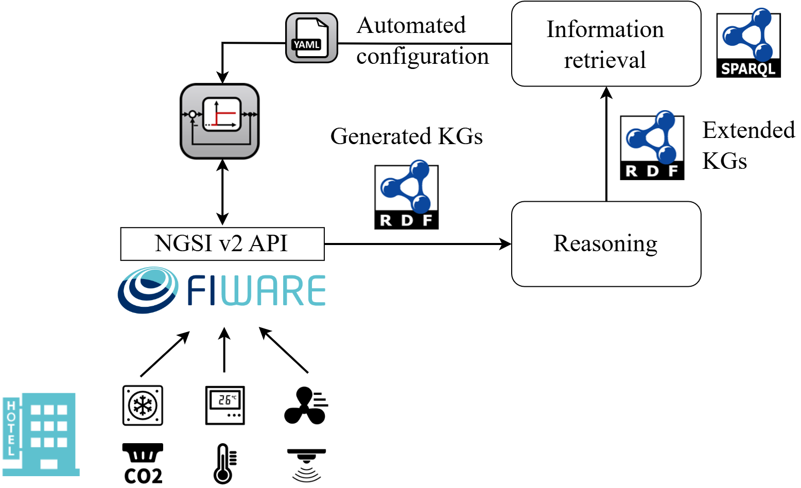

## Demonstration with FIWARE

### Introduction
This is a demonstration of how to use **semantic-iot** framework to build up a Knowledge Graph Construction Pipline (**KGCP**) for FIWARE platform specialized for smart hotel use cases.



To use the **semantic-iot** framework, **data models** must be already defined. Data stored in the IoT platform must also conform with the specific data models.
In this demonstration, we provide data models for hotel energy systems in Python using [Pydantic](https://pydantic-docs.helpmanual.io/).
These data models can be found in [`./datamodels/pydantic_models.py`](./datamodels/pydantic_models.py).

Data models can also be defined in more conventional way, like UML, entity-relationship diagram, etc. Important is to create **an example dataset** that fully represents the data models, i.e., the naming convention, interrelational information, and the availability of data.
In this demonstration, we provide this example dataset as [`./kgcp/rml/example_hotel.json`](./kgcp/rml/example_hotel.json), which can also be created using the data model script.

The script [`./datamodels/hotel_provision.py`](./datamodels/hotel_provision.py) provisions different hotel systems to the FIWARE platform, thus, generating different datasets as can be found in [`./hotel_dataset`](./hotel_dataset). 
> **Note**: If you do like to provision hotel systems on FIWARE platform, please first deploy a FIWARE platform stack locally. You can use the docker configuration in [`./platform_deployment`](./platform_deployment).

Currently, we have tested with multiple ontologies in the building systems domain, including [Brick](https://brickschema.org/), [SAREF4BLDG](https://saref.etsi.org/saref4bldg), and [DogOnt](https://iot-ontologies.github.io/dogont/documentation/index-en.html). For the simplicity, we will use Brick for the demonstration.
>**Note**: For SAREF4BLDG and DogOnt, you can view the results under [`./kgcp/rml/saref4bldg`](./kgcp/rml/saref4bldg) and [`./kgcp/rml/dogont`](./kgcp/rml/dogont) respectively.

### Prerequisites
Install the **semantic-iot** framework:
```bash
git clone https://github.com/N5GEH/semantic-iot.git
cd semantic-iot
pip install .
```

Install extra dependencies needed for this demonstration.

```bash
pip install -r examples/fiware/requirements.txt
```
> **Note**: This demonstration currently has dependency issues with the **semantic-iot** framework. Therefore, you may see some warnings when installing the requirements. However, **you can ignore them**. We are working on fixing this issue.

### Step 1 data model identification & vocabulary mapping
Set up the FIWARE platform specific configuration is the first step.
In this demonstration, we provide a configuration file [`./kgcp/rml/iware_config.json`](./kgcp/rml/fiware_config.json) for the specialized FIWARE platform:
```json
{
    "ID_KEY": "id",
    "TYPE_KEYS": [
        "type"
    ]
}
```

After understanding this, you can start the data model identification and terminology mapping by running the script [`./kgcp/rml_preprocess.py`](./kgcp/rml_preprocess.py). In this case, the above configuration file and the domain ontology for building energy system, brick, are given as input.
> **Beta**: The terminology mapping is by default based on the **string similarity**.
> A **beta** functionality using the embedding-model of [sentence-transformers](https://www.sbert.net/) has been implemented, which find suitable terminologies based on the semantic similarity. 

Note that in  [`./kgcp/rml_preprocess.py`](./kgcp/rml_preprocess.py) there is an input that depends on the data model and the ontology used, i.e., `patterns_splitting`.
This parameter is used to mitigate the issue of semantic difference between the data model and the ontology, for example, while the actuator setpoints are modeled as attributes of the corresponding devices, the Brick ontology requires the setpoints to be separate resources in KGs.
This parameter contains a list of patterns, i.e., JSONPath, that are used to identify such substructures in the platform dataset.
An initial run might be necessary to identify this semantic difference and to define the corresponding JSONPaths.
For Brick ontology, the ``patterns_splitting`` is defined as: `["\$..fanSpeed","\$..airFlowSetpoint","\$..temperatureSetpoint"]`.

### Step 2 validation and completion
The last step generate a human-friendly report, i.e., **"intermediate report"**, which can be found as [`./kgcp/rml//brick/intermediate_report_brick.json`](./kgcp/rml//brick/intermediate_report_brick.json).
In this report, different **resource types** in the data models are identified and the terminology mappings to specific terms of the ontology are suggested based on the **string similarity**.
For example, for the resource type `TemperatureSensor`:
````json
{
    "nodetype": "TemperatureSensor",
    "iterator": "$[?(@.type=='TemperatureSensor')]",
    "class": "**TODO: PLEASE CHECK** brick:Temperature_Sensor",
    "hasRelationship": [
        {
            "relatedNodeType": "HotelRoom",
            "propertyClass": "**TODO: PLEASE CHECK** brick:hasLocation",
            "rawdataidentifier": "hasLocation.value"
        }
    ],
    "hasDataAccess": null
}
````

Manual validation and completion are now required for:
1. Verify the terminology suggestion for **subject**. For example, the ideal ontology class for `TemperatureSensor` in our data models should be `brick:Air_Temperature_Sensor`.
2. Verify the terminology suggestion for **predicate**. For example, the property class `brick:isPointOf` should be used to connect the `TemperatureSensor` to `HotelRoom`.
3. Complete the field `hasDataAccess` for accessing the data (or actuation setpoints). For example, for `TemperatureSensor` the temperature can be accessed by "https://<host>/v2/entities/{id}/attrs/temperature/value" via the FIWARE API.

After that, the completed information for `TemperatureSensor` should look like this:
```json
{
    "identifier": "id",
    "nodetype": "TemperatureSensor",
    "extraNode": false,
    "iterator": "$[?(@.type=='TemperatureSensor')]",
    "class": "brick:Air_Temperature_Sensor",
    "hasRelationship": [
        {
            "relatedNodeType": "HotelRoom",
            "propertyClass": "brick:isPointOf",
            "rawdataidentifier": "hasLocation.value"
        }
    ],
    
    "hasDataAccess": "https://fiware.eonerc.rwth-aachen.de/v2/entities/{id}/attrs/temperature/value"
}
```

A validated and completed **"intermediate report"** document for this example is provided in [`./kgcp/rml/brick/intermediate_report_validated_brick.json`](./kgcp/rml/brick/intermediate_report_validated_brick.json).

### Step 3 generate mapping file to build KGCP
Based on the completed **"intermediate report"** document, we can generate the RML mapping file for the KGCP.
In this demonstration, this step can be conducted by running the script [`./kgcp/rml_generate.py`](./kgcp/rml_generate.py).
The generated RML mapping file can be found in [`./kgcp/rml/brick/fiware_hotel_rml.ttl`](kgcp/rml/brick/fiware_hotel_rml.ttl).

### Step 4 apply KGCP (including HTTP Extension)
Now that you’ve generated your RML mappings, you can run the KGCP to produce both the base KG and the HTTP‐augmented KG:
[``./kgcp/fiware_kgcp.py``](./kgcp/fiware_kgcp.py) 

**What happens under the hood:**

- **RDF Generation**  
  - Uses `fiware_hotel_rml.ttl` and your JSON dataset to create `hotel_name.ttl` with all entities and relationships.

- **HTTP Extension**  
  - Loads the newly created `hotel_name.ttl`, the OpenAPI spec (`api_spec.json`), and the HTTP ontology (`Http.ttl`).  
  - Scans for every `rdf:value` URI in the base KG.  
  - For each matching `/…/value` endpoint, creates `http:Request` nodes (GET & PUT) with properties:  
    - `http:methodName`  
    - `http:absolutePath`  
    - `http:absoluteURI`  
    - `http:authority`  
  - Builds `http:MessageHeader` instances for:  
    - **Global headers** (e.g. `fiware-service`)  
    - **Inline headers** (operation-specific, e.g. `Content-Type`)  
  - Links each header via `http:fieldName`, `http:fieldValue`, and `http:hdrName`.  
  - Attaches all headers to the corresponding requests via `http:headers` and groups requests under a shared `http:Connection`.  
  - Writes out `hotel_name_extended.ttl`.  

After running, you’ll find in `kgcp/results/` for each hotel dataset:  
- `fiware_entities_N.ttl`  
- `fiware_entities_N_extended.ttl`  
- _(and, if enabled)_ `metrics_*.json`  


### Step 5 automated service deployment
The generated knowledge graph of a hotel IoT system can be used to deploy services, for example a building automation program, automatically.

To enable generic information extraction, we can apply logical inference, i.e., reasoning, to the generated knowledge graph. The script
[``./application_deployment/reasoning_owl_rl.py``](./application_deployment/reasoning_owl_rl.py) uses the [OWL-RL](https://owl-rl.readthedocs.io/en/latest/owlrl.html) to infer new knowledge based on the used brick ontology and the existing knowledge graphs. The inferred knowledge graph for the hotel with 10 rooms is provided as an example in [`./application_deployment/fiware_entities_10rooms_inferred.ttl`](./application_deployment/fiware_entities_10rooms_inferred.ttl). After the inference, the number of triples increases from 263 to 1597.

Since a lot of class subsumption relationships are inferred, generic information extraction can be applied to the inferred knowledge graph. For example, the class ``Ventilation_Air_System`` is inferred to be a subclass of ``Air_System`` and ``HVAC_System``. Therefor, all existing actuation for the air system in hotel rooms can be retrieved by the following SPARQL query:
```sparql
PREFIX brick: <https://brickschema.org/schema/Brick#>
PREFIX rec: <https://w3id.org/rec#>
PREFIX rdf: <http://www.w3.org/1999/02/22-rdf-syntax-ns#>

SELECT ?room ?airSystem ?actuation ?actuation_type ?actuation_access
WHERE {
  ?room a rec:Room .
  ?airSystem a brick:Air_System ;
             brick:hasLocation ?room .
  OPTIONAL {
    ?actuation a ?actuation_type ;
               brick:isPointOf ?airSystem ;
               rdf:value ?actuation_access .
    VALUES ?actuation_type { brick:Setpoint brick:Command }
  }
}
```
By applying this approach to extract information about the presence of sensors and actuators, and data interactions via the platform API, building automation programs can be configured automatically:
```yaml
- controller_function: Ventilation  # Control function Ventilation/Heating/Cooling
  controller_mode: <...>  # co2/presence/timetable
  inputs:
    sensor_access: <...>  # URL to access the sensor data
  outputs:
    actuation_access: <...>  # URL to access the actuation function
```

An example of such automated configuration is provided in [`./application_deployment/controller_configuration.py`](./application_deployment/controller_configuration.py). 
The result is a configuration file for the distributed air systems in hotel, e.g., [`./application_deployment/controller_configs/fiware_entities_10rooms_inferred.yml`](./application_deployment/controller_configs/fiware_entities_10rooms_inferred.yml). 