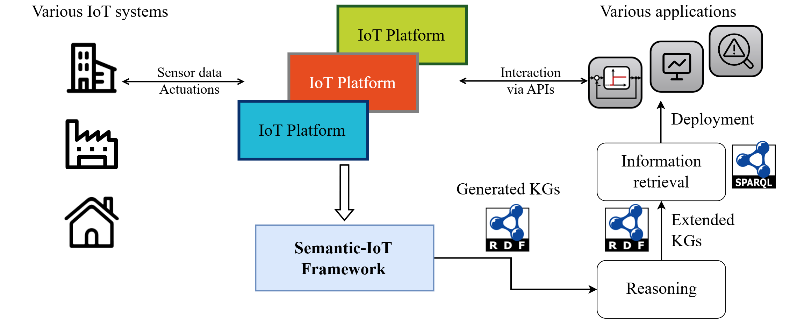
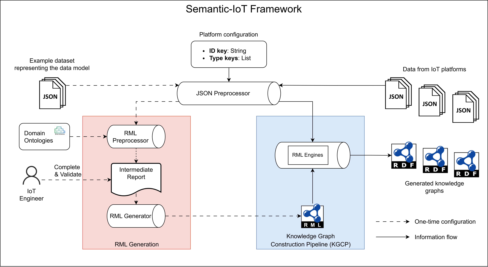

# Semantic-IoT
Semantic-IoT is an innovative framework for generating knowledge graphs from data provisioned in IoT platforms.
It aims to enhance the interoperability across different IoT systems by providing a unified semantic representation of IoT data.
Hence, service providers can utilize the generated knowledge graphs to retrieve necessary information about the underlying IoT systems and the IoT middlewares in a standardized way.



In the building sector, for example, individual building systems are often managed by different IoT platforms, such as FIWARE, OpenHAB, or Home Assistant, etc.
The heterogeneity from both sides leads to a lack of interoperability.
Specifically, although promising smart building applications exist, such as building automation, fault detection, and energy monitoring, the deployment of these applications is a laborious task.
Field engineers have to explore individual systems to make applications work properly.
Semantic-IoT addresses this challenge by significantly facilitating the generation of knowledge graphs from IoT platforms, which can be used by the application providers to retrieve information about the underlying building systems, hence enabling automated deployment processes. 

### Technical Overview
Following image gives an technical overview of the Semantic-IoT framework.
This framework utilizes the [RDF Mapping Language (RML)](https://rml.io/specs/rml/) to facilitate the mapping of heterogeneous IoT data into structured and expressive knowledge graphs.



The framework mainly contains:

**RML Generation**
- **RML Preprocessor**: processes example dataset of an IoT platform to generate an intermediate document for further usage. This document need to be manually validated and completed.
- **RML Generator**: generate RML mapping file based on the manual validated document.

**Knowledge Graph Construction Pipeline (KGCP)**
- **RDF Generator**: utilize the RML mapping file to generate knowledge graphs for any data provisioned in IoT platforms (most likely different platform instances).

### Work with Python

#### Installation
```bash
git clone https://github.com/N5GEH/semantic-iot.git
cd semantic-iot
pip install .
```

#### Usage
Please check the [example](examples/fiware) for a detailed instruction on how to use the Semantic-IoT framework with Python. A FIWARE platform specialized for smart hotel use cases is demonstrated. 

[//]: # (### Work with Docker)

[//]: # (Coming soon...)

### Scalability and Efficiency
To evaluate the feasibility of the KGCP for practical use, we measure the RAM usage and processing time for different sizes of data volumes.
The original datasets scale from 4.7 KB to 1.8 MB,
resulting in generated KGs with 55 and 23,003 triples, respectively.


The results show that the required memory and time grow linearly with the data volumes, so that the KGCP is scalable for large datasets.
Besides, the memory usage is significantly smaller than the memory required for an IoT-platform (e.g., 1 GB for a typical FIWARE platform).
Therefore, the proposed framework can be effectively integrated with existing IoT platforms.

### Acknowledgments

We gratefully acknowledge the financial support of the Federal Ministry <br /> 
for Economic Affairs and Climate Action (BMWK), promotional references 03EN1030B.

<a href="https://www.bmwi.de/Navigation/EN/Home/home.html">  </a>

